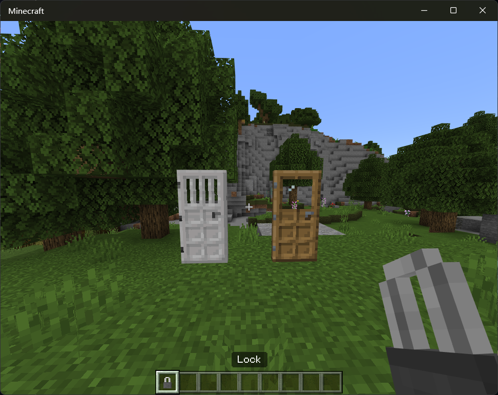

# DoorLock

This is a plugin that allows you to lock a door in your PNX server!

If you found any bugs or have any suggestions, please open an issue on [GitHub](https://github.com/PowerNukkitX/DoorLock/issues)

If you like this plugin, please star it on [GitHub](https://github.com/PowerNukkitX/DoorLock)

## Download
- [Releases](https://github.com/PowerNukkitX/DoorLock/releases)
- [Snapshots](https://circleci.com/gh/PowerNukkitX/DoorLock)

## Compiling
1. Install [Maven](https://maven.apache.org/).
2. Run `mvn clean package`. The compiled JAR can be found in the `target/` directory.